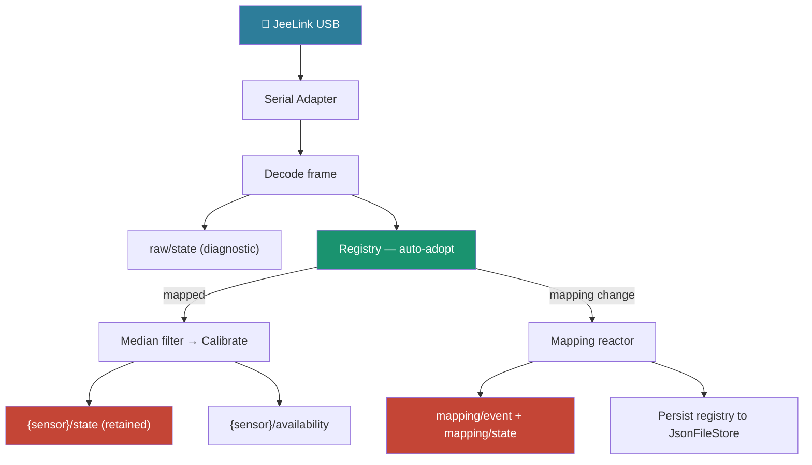

# jeelink2mqtt

**Bridge LaCrosse temperature and humidity sensors to MQTT via a JeeLink USB receiver.**

jeelink2mqtt reads frames from LaCrosse TX29DTH-IT wireless sensors through a
JeeLink USB stick, maps ephemeral sensor IDs to stable logical names, applies
signal conditioning and calibration, and publishes readings to an MQTT broker
for consumption by home-automation systems.

Built on the [cosalette](https://github.com/ff-fab/cosalette) application
framework.

---

## Key Features

**Smart Sensor ID Management**
:   LaCrosse sensors generate a new random ID on every battery swap.
    jeelink2mqtt's auto-adopt algorithm detects the change and re-maps
    the ID automatically — no manual intervention needed
    ([ADR-002](adr/ADR-002-sensor-id-management-strategy.md)).

**Per-Sensor Calibration Offsets**
:   Each sensor can carry individual temperature and humidity offsets,
    compensating for manufacturing tolerances. Compare against a
    reference thermometer once, set the offset, forget about it.

**Median Filter Signal Conditioning**
:   A configurable sliding-window median filter (default window 7)
    rejects spurious outlier readings before they reach your dashboard.

**MQTT Command Interface**
:   Manual mapping control (`assign`, `reset`, `reset_all`,
    `list_unknown`) via JSON commands on `jeelink2mqtt/mapping/set`.
    Useful when multiple sensors fail simultaneously.

**Dry-Run Mode**
:   Run without hardware — a fake adapter generates synthetic readings
    so you can validate configuration and MQTT integration before
    plugging in the receiver.

**Persistent Registry**
:   Sensor mappings are persisted to `data/jeelink2mqtt.json` and
    survive restarts. No lost state after a reboot.

---

## Architecture Overview



For each decoded LaCrosse frame the receiver executes these steps in order:

1. The **JeeLink USB** receiver captures 868 MHz LaCrosse frames.
2. A **serial adapter** (production: `pylacrosse`; dry-run: fake) bridges hardware to Python callbacks.
3. The **frame parser** decodes raw strings into typed `SensorReading` objects.
4. Every frame is published non-retained to `jeelink2mqtt/raw/state` as a **raw diagnostic** — before any filtering or mapping.
5. The **registry** routes the ephemeral sensor ID to a logical name via auto-adopt or manual assignment.
6. For mapped sensors, `filter_and_calibrate` applies per-sensor **median filtering** (outlier rejection) then **calibration offsets**.
7. The calibrated reading is published as retained JSON to `jeelink2mqtt/{sensor}/state` and `jeelink2mqtt/{sensor}/availability`.
8. After each frame yields, the **mapping reactor** drains any queued `MappingEvent` objects, publishes `jeelink2mqtt/mapping/event` and `jeelink2mqtt/mapping/state` to MQTT, and persists the registry snapshot to `JsonFileStore`.

---

## Quick Start

Get your first readings in three steps — see the full
[Getting Started](getting-started.md) guide:

```bash
# 1. Install
uv add jeelink2mqtt

# 2. Configure (minimal .env)
cat > .env << 'EOF'
JEELINK2MQTT_SERIAL_PORT=/dev/ttyUSB0
JEELINK2MQTT_MQTT__HOST=localhost
JEELINK2MQTT_SENSORS='[{"name": "living_room"}, {"name": "outdoor"}]'
EOF

# 3. Run
jeelink2mqtt
```

Or try without hardware:

```bash
jeelink2mqtt --dry-run
```

---

## Documentation Map

| Page | What you'll find |
|------|------------------|
| [Getting Started](getting-started.md) | First-success onboarding |
| [Setup](setup.md) | Hardware, broker, and detailed configuration |
| [User Guide](user-guide.md) | Mapping flows, commands, calibration |
| [Operations](operations.md) | Docker, systemd, monitoring, persistence |
| [Troubleshooting](troubleshooting.md) | Common issues and fixes |
| [Reference](reference.md) | Settings, topics, commands, API |
