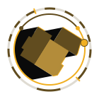
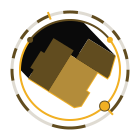
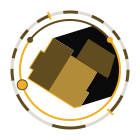
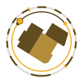

# suncast

Solar shadow visualization service — generates real-time SVG sundials showing building
shadows based on your location and building geometry.

[](LICENSE)
[](https://www.python.org/)
[](https://github.com/ff-fab/cosalette)

Built on the [cosalette](https://github.com/ff-fab/cosalette) IoT framework. Inspired by
the sun position visualization concept shared by
[pmpkk (Patrick)](https://community.openhab.org/t/show-current-sun-position-and-shadow-of-house-generate-svg/34764)
on the openHAB community forum.

## Shadow Visualization

suncast renders an SVG compass dial with your building footprints and their real-time
shadows. The sun position marker, day/night arc, and shadow projections update on each
poll cycle.

<p align="center">
  
  
  
  
</p>

<p align="center"><em>Summer solstice — morning, noon, afternoon, night</em></p>

## Quick Start

Create a directory and add this `docker-compose.yml`:

```yaml
services:
  suncast:
    image: ghcr.io/ff-fab/suncast:latest
    restart: unless-stopped
    env_file: .env
    environment:
      SUNCAST_MQTT__HOST: mosquitto
    volumes:
      - shadow-output:/output
      - ./geometry.yaml:/app/geometry.yaml:ro

  shadow-web:
    image: nginx:alpine
    restart: unless-stopped
    ports:
      - '8080:80'
    volumes:
      - shadow-output:/usr/share/nginx/html:ro

  mosquitto:
    image: eclipse-mosquitto:2
    restart: unless-stopped
    ports:
      - '1883:1883'
    volumes:
      - ./mosquitto.conf:/mosquitto/config/mosquitto.conf:ro
      - mosquitto-data:/mosquitto/data

volumes:
  shadow-output:
  mosquitto-data:
```

Then fetch the supporting files and start:

```bash
curl -fsSL https://raw.githubusercontent.com/ff-fab/cosalette-apps/main/apps/suncast/mosquitto.conf -o mosquitto.conf
curl -fsSL https://raw.githubusercontent.com/ff-fab/cosalette-apps/main/apps/suncast/.env.example -o .env
curl -fsSL https://raw.githubusercontent.com/ff-fab/cosalette-apps/main/apps/suncast/geometry.example.yaml -o geometry.yaml
# Edit .env — set SUNCAST_LATITUDE, SUNCAST_LONGITUDE, SUNCAST_TIMEZONE
# Edit geometry.yaml — define your building footprints
docker compose up -d
```

The SVG is written to the shared volume and served by nginx at
`http://localhost:8080/shadow.svg`.

## Features

- True parallel shadow projection with silhouette detection
- Compass dial with sun position marker and day/night arc
- Configurable building geometry via YAML or JSON
- Automatic auto-scaling of buildings to fit the canvas circle
- Sundial ring with hour markers (circle or bar style)
- Illuminated-edge highlight on the sun-facing side
- Highlighted regions (e.g., garden, terrace) with custom colors
- Optional PNG output via CairoSVG
- Optional built-in HTTP server for direct SVG serving
- Automatic MQTT health reporting (heartbeats, LWT, availability)

## Configuration

All settings are loaded from environment variables (`SUNCAST_` prefix), `.env` files, or
CLI flags. See [.env.example](.env.example) for a ready-to-copy template.

### Required Settings

| Variable            | Description                           |
| ------------------- | ------------------------------------- |
| `SUNCAST_LATITUDE`  | Location latitude (-90 to 90)         |
| `SUNCAST_LONGITUDE` | Location longitude (-180 to 180)      |
| `SUNCAST_TIMEZONE`  | IANA timezone (e.g., `Europe/Berlin`) |

### Geometry

Buildings are defined in a YAML file (default: `geometry.yaml`). Each building is a
named polygon with vertices on a 0–100 coordinate grid:

```yaml
canvas:
  size: 100
  north_rotation: 0

buildings:
  - name: house
    style: home
    vertices:
      - [40, 35]
      - [65, 35]
      - [65, 65]
      - [40, 65]
```

See [geometry.example.yaml](geometry.example.yaml) for a complete example with multiple
buildings and highlighted regions.

## MQTT Topics

| Topic                           | Direction | Description                                |
| ------------------------------- | --------- | ------------------------------------------ |
| `suncast/status`                | Publish   | Heartbeat with app status, uptime, version |
| `suncast/{device}/state`        | Publish   | Device state (if using named devices)      |
| `suncast/{device}/availability` | Publish   | `online` / `offline`                       |
| `suncast/error`                 | Publish   | Structured error reports                   |

## Development

See [CONTRIBUTING.md](CONTRIBUTING.md) for setup instructions, common commands, project
structure, and development guidelines.

## License

This program is free software: you can redistribute it and/or modify it under the terms
of the GNU General Public License as published by the Free Software Foundation, either
version 3 of the License, or (at your option) any later version. See [LICENSE](LICENSE)
for details.
