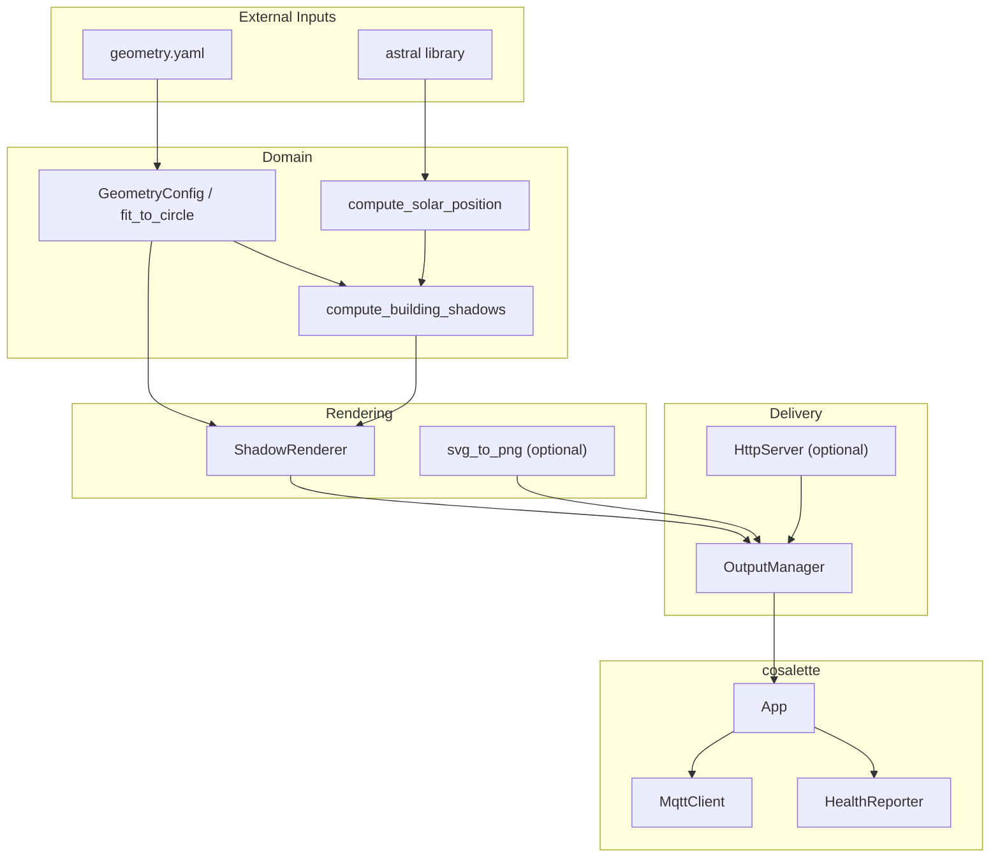
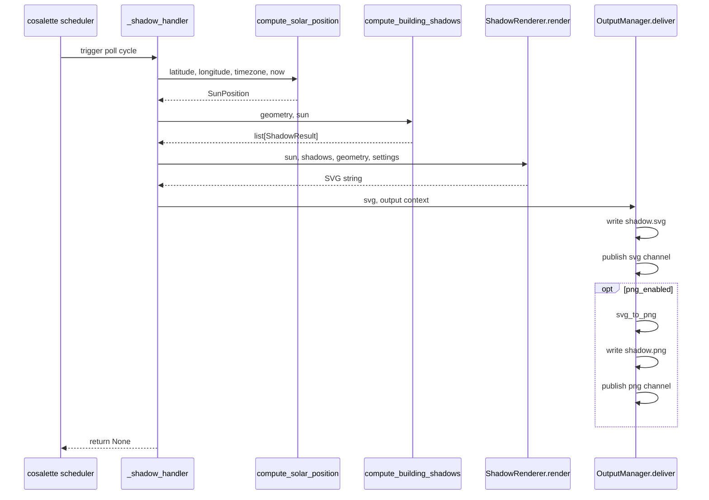

# Architecture

suncast follows the **Ports & Adapters** (hexagonal) architecture pattern. Domain logic
— solar position computation, shadow projection, and geometry handling — has zero I/O
dependencies. The [cosalette](https://github.com/ff-fab/cosalette) IoT framework
handles MQTT connectivity, health reporting, error isolation, and graceful shutdown.

---

## Overview

```mermaid
graph TD
  subgraph External Inputs
    YAML[geometry.yaml]
    ASTRAL[astral library]
  end

  subgraph Domain
    GEOM["GeometryConfig / fit_to_circle"]
    SOLAR[compute_solar_position]
    SHADOW[compute_building_shadows]
  end

  subgraph Rendering
    RENDERER[ShadowRenderer]
    RASTER["svg_to_png (optional)"]
  end

  subgraph Delivery
    OUTPUT[OutputManager]
    HTTP["HttpServer (optional)"]
  end

  subgraph cosalette
    APP[App]
    MQTT[MqttClient]
    HR[HealthReporter]
  end

  YAML --> GEOM
  ASTRAL --> SOLAR
  GEOM --> SHADOW
  SOLAR --> SHADOW
  GEOM --> RENDERER
  SHADOW --> RENDERER
  RENDERER --> OUTPUT
  RASTER --> OUTPUT
  HTTP --> OUTPUT
  OUTPUT --> APP
  APP --> MQTT
  APP --> HR
```

---

## Layers

### Domain (`suncast.domain`)

Pure computation — no I/O, no async. All modules are independently testable.

| Module         | Purpose                                                             |
| -------------- | ------------------------------------------------------------------- |
| `solar`        | Solar position from lat/lon/time via `astral`                       |
| `shadow`       | Silhouette detection + parallel projection → shadow polygons        |
| `geometry`     | YAML/JSON loader, Pydantic validation, `fit_to_circle` auto-scaling |
| `geometry_svg` | SVG file importer with sidecar support                              |

`compute_solar_position` returns a `SunPosition` dataclass with azimuth, elevation,
sunrise/sunset azimuths and times, and hourly azimuths for the sundial ring.
`compute_building_shadows` takes a `GeometryConfig` and `SunPosition` and returns a
list of `ShadowResult` (one per building with its shadow polygon and sun-facing edges).

### Rendering

| Module      | Purpose                                                                 |
| ----------- | ----------------------------------------------------------------------- |
| `renderer`  | SVG assembly: buildings, shadows, sundial ring, day/night arc, markers  |
| `rasterize` | Optional PNG conversion via CairoSVG                                    |

`ShadowRenderer.render()` produces a complete SVG string. `svg_to_png()` converts that
string to PNG bytes when the `png` extra is installed.

### Output

| Module        | Purpose                                                                 |
| ------------- | ----------------------------------------------------------------------- |
| `output`      | Filesystem + MQTT delivery: writes files, publishes to svg/png channels |
| `http_server` | Optional aiohttp server for `/shadow.svg` and `/shadow.png`             |

`OutputManager.deliver()` orchestrates all three delivery channels (filesystem, MQTT,
HTTP cache) in a single call.

---

## Data Flow

Each poll cycle follows this path through the pipeline:

```mermaid
sequenceDiagram
  participant COS as cosalette scheduler
  participant H as _shadow_handler
  participant SOL as compute_solar_position
  participant SH as compute_building_shadows
  participant R as ShadowRenderer.render
  participant O as OutputManager.deliver

  COS->>H: trigger poll cycle
  H->>SOL: latitude, longitude, timezone, now
  SOL-->>H: SunPosition
  H->>SH: geometry, sun
  SH-->>H: list[ShadowResult]
  H->>R: sun, shadows, geometry, settings
  R-->>H: SVG string
  H->>O: svg, output context
  O->>O: write shadow.svg
  O->>O: publish svg channel
  opt png_enabled
    O->>O: svg_to_png
    O->>O: write shadow.png
    O->>O: publish png channel
  end
  H-->>COS: return None
```

The handler returns `None` — suncast publishes visual output through dedicated MQTT
channels (`svg`, `png`) rather than the framework's automatic `/state` topic.

---

## Pipeline Initialization

The `init=` callback (`_build_pipeline`) runs once at device startup and builds a
`PipelineState` dataclass containing:

1. **GeometryConfig** — loaded from YAML/JSON/SVG, then auto-scaled via `fit_to_circle()`
2. **ShadowRenderer** — stateless SVG assembler
3. **RenderSettings** — colors, stroke width, marker style (from settings)
4. **OutputManager** — configured delivery channels (from settings)

This state is injected into the handler via cosalette's type-based DI system.

---

## cosalette Framework

suncast is built on [cosalette](https://github.com/ff-fab/cosalette), a lightweight
framework for IoT-to-MQTT bridges. cosalette provides:

- **App composition root** — wires devices, adapters, settings, and lifecycle
- **Device decorators** — `@app.telemetry`, `@app.command`, `@app.device`
- **MQTT management** — auto-reconnect, LWT, topic conventions
- **Health reporting** — periodic heartbeats, per-device availability
- **Error isolation** — exceptions in one device don't crash the app
- **Dependency injection** — settings and services resolved by type annotation
- **Graceful shutdown** — SIGTERM/SIGINT → shutdown event → clean teardown
- **Lifespan hooks** — suncast uses this for the optional HTTP server

The module-level `app` in `app.py` is the composition root — it creates the `App`,
registers the shadow telemetry with `@app.telemetry`, and wires the HTTP lifespan.
The `get_app()` function is the preferred accessor for the module-level app instance.
`create_app()` is retained as a compatibility alias — it does not construct a new App
and always returns the same instance.

---

## Further Reading

- [cosalette documentation](https://ff-fab.github.io/cosalette/) — the IoT framework
