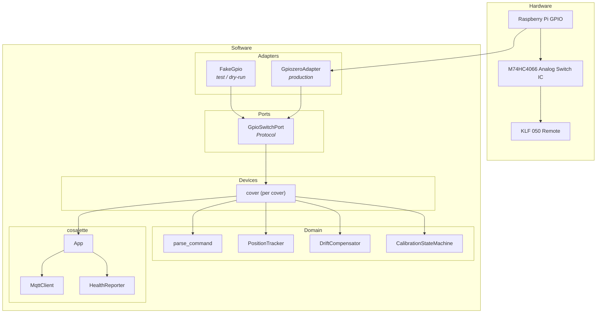
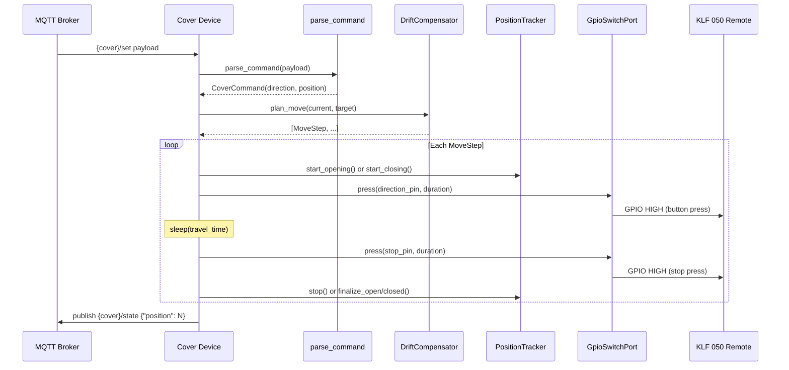

# Architecture

velux2mqtt follows the **Ports & Adapters** (hexagonal) architecture pattern. Domain
logic has zero I/O dependencies --- all hardware and network access goes through protocol
boundaries. The [cosalette](https://github.com/ff-fab/cosalette) IoT framework handles
MQTT connectivity, health reporting, error isolation, and graceful shutdown.

---

## Overview

---

## Layers

### Ports

The hardware boundary. Ports are Python `Protocol` classes that define the interface
between domain logic and the outside world.

| Port             | Methods                                          | Purpose                      |
| ---------------- | ------------------------------------------------ | ---------------------------- |
| `GpioSwitchPort` | `press()`, `initialize()`, `cleanup()`, context manager | GPIO-driven analog switches  |

The port provides an `async press(pin, duration)` method that pulses a GPIO pin HIGH for
a given duration, simulating a physical button press on the KLF 050 remote. Code that
depends on `GpioSwitchPort` never touches GPIO directly.

### Adapters

Concrete implementations of ports. Swapped at runtime --- production vs. test/dry-run.

| Adapter           | Port             | Description                                          |
| ----------------- | ---------------- | ---------------------------------------------------- |
| `GpiozeroAdapter` | `GpioSwitchPort` | Production adapter using `gpiozero.DigitalOutputDevice` |
| `FakeGpio`        | `GpioSwitchPort` | Records all interactions for testing (no hardware)   |

Adapters are registered with `cosalette.App(adapters={...})` and resolved via
`ctx.adapter(GpioSwitchPort)` inside device functions --- no global variables, no
import-time side effects.

### Domain

Pure business logic with **no I/O dependencies**. Each module is independently testable.

| Module                    | Purpose                                                    |
| ------------------------- | ---------------------------------------------------------- |
| `PositionTracker`         | Time-based position estimation (0--100%)                   |
| `parse_command`           | Parse MQTT payloads into typed `CoverCommand` values       |
| `DriftCompensator`        | Automatic endpoint recalibration after intermediate moves  |
| `CalibrationStateMachine` | Multi-run timed calibration procedure                      |

#### Position Tracking

Since Velux covers have no position feedback sensor, position is estimated from travel
time. The `PositionTracker` maintains the current position as a float (0.0--100.0) and
uses configured travel durations to calculate how far the cover has moved.

Key concepts:

- **Travel duration**: the time for a full open or close traversal (configured per cover,
  asymmetric --- up and down can differ)
- **Travel time offset**: a fixed delay subtracted from elapsed time to account for motor
  start/stop lag
- **Position semantics**: 0% = fully closed (down), 100% = fully open (up), matching
  Home Assistant conventions

#### Drift Compensation

After several consecutive intermediate moves (not to 0% or 100%), timing errors
accumulate. The `DriftCompensator` tracks consecutive intermediate moves and, when the
configured threshold is reached, plans a recalibration detour through the nearest
endpoint before continuing to the target.

#### Dead Band

Some Velux covers (particularly windows) have a handle that must rotate before the cover
begins moving. This "dead band" is a portion of total travel where the motor runs but the
cover position doesn't change. velux2mqtt accounts for this:

- **Opening from 0%**: waits for the dead band time (handle rotation) before starting the
  position tracker
- **Closing to 0%**: after effective travel completes, waits for the handle to close
  before pressing stop

### Devices

Each configured cover is registered as a cosalette device using `app.add_device()`. The
device function owns the full lifecycle:

| Device            | Type           | Description                                           |
| ----------------- | -------------- | ----------------------------------------------------- |
| `cover` (per cfg) | `@app.device`  | Command loop: parses commands, executes GPIO moves, tracks position |

The device function is created by `make_cover()`, which captures the per-cover
configuration via closure. Each cover instance has its own `PositionTracker`,
`DriftCompensator`, and `CalibrationStateMachine`.

---

## Data Flow

### Normal Operation

### Startup Homing

On startup (when `enable_startup_homing` is true), each cover moves to a known endpoint
to establish a reliable position reference:

1. Press the homing direction button (default: down/close)
2. Wait for full travel duration plus safety margin
3. Press stop
4. Set the position tracker to the endpoint (0% or 100%)

---

## cosalette Framework

velux2mqtt is built on [cosalette](https://github.com/ff-fab/cosalette), a lightweight
framework for IoT-to-MQTT bridges. cosalette provides:

- **App composition root** --- wires devices, adapters, settings, and lifecycle
- **Device decorators** --- `@app.device`, `@app.telemetry`, `@app.command`
- **MQTT management** --- auto-reconnect, LWT, topic conventions
- **Health reporting** --- periodic heartbeats, per-device availability
- **Error isolation** --- exceptions in one device don't crash the app
- **Dependency injection** --- adapters and settings resolved by type annotation
- **Graceful shutdown** --- SIGTERM/SIGINT -> shutdown event -> clean teardown

The module-level `app` object in `main.py` is the composition root --- it registers the
GPIO adapter, iterates over cover configurations, and registers each cover as a device
via `app.add_device()`.

---

## Key Design Decisions

- **One device per cover**: each cover has independent state (position, drift counter,
  calibration). This is achieved via `app.add_device()` in a loop rather than a single
  device managing all covers.
- **`@app.device` over `@app.telemetry`**: covers need command handling, multi-step GPIO
  sequences, and long-running state. The full-lifecycle device pattern is the right fit.
- **Closure-based device creation**: `make_cover()` returns an async callable that
  captures cover configuration, avoiding the need for a device class or global state.
- **GPIO as analog switch driver**: the Raspberry Pi GPIO pins don't directly control the
  Velux motor. They drive an M74HC4066 analog switch IC that bridges the button contacts
  on a KLF 050 radio remote. This means velux2mqtt simulates physical button presses.

---

## Further Reading

- [Ports & Adapters (Hexagonal Architecture)](https://alistair.cockburn.us/hexagonal-architecture/)
  --- the architectural pattern used by velux2mqtt
- [cosalette documentation](https://ff-fab.github.io/cosalette/) --- the IoT framework
- [ADR-001: cosalette Migration](adr/ADR-001-cosalette-migration.md) --- why velux2mqtt
  adopted cosalette
- [Calibration](calibration.md) --- the timed calibration procedure
