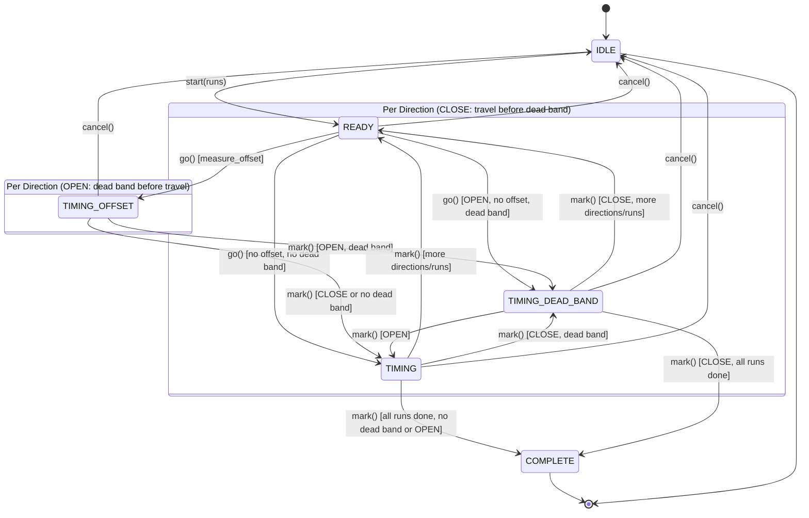

# Calibration

velux2mqtt estimates cover position from travel time. The calibration procedure measures
the actual travel durations for your specific cover installation so the position tracker
is accurate.

---

## Why Calibrate?

Every Velux cover has slightly different travel times depending on the motor, the cover
size, and the installation. The factory defaults in the configuration are starting points,
but calibration measures the real values for your setup. Calibration can also measure:

- **Motor start lag (offset)**: the delay between pressing a button and the cover
  actually starting to move
- **Dead band (handle rotation)**: for window covers, the time the handle rotates before
  the window begins to open or close

---

## Prerequisites

Before calibrating:

1. The cover must be controllable via MQTT (velux2mqtt running, MQTT broker connected)
2. You need visual access to the cover to observe when it starts and stops moving
3. Decide which measurements you need:
    - **Travel only** (default): measures close and open durations
    - **Travel + offset**: also measures motor start lag
    - **Travel + offset + dead band**: also measures handle rotation time (windows)

---

## Step-by-Step Procedure

### 1. Start Calibration

Send to `velux2mqtt/{cover}/set`:

```json
{"calibrate": "start"}
```

Or with options:

```json
{"calibrate": "start", "runs": 3, "measure_offset": true, "measure_dead_band": true, "starting_state": "closed"}
```

| Option              | Default                          | Description                    |
| ------------------- | -------------------------------- | ------------------------------ |
| `runs`              | `VELUX2MQTT_CALIBRATION_RUNS` (3) | Number of measurement cycles  |
| `measure_offset`    | per-cover `measure_offset` setting | Measure motor start lag      |
| `measure_dead_band` | `false`                          | Measure handle rotation time   |
| `starting_state`    | `"closed"`                       | Physical state of the cover: `"closed"` or `"open"` |

**Starting position:** the default assumes the cover is **fully closed** (0%).
The first measurement direction will be `OPEN` (moving from closed to open), followed by
`CLOSE`. If the cover is fully open instead, pass `"starting_state": "open"` so the first
direction is `CLOSE`. The business logic does not home the cover automatically — if the
cover is not in the declared starting position, the first measurement will be inaccurate.

### 2. Trigger Movement

When you are ready, send:

```json
{"calibrate": "go"}
```

This presses the direction button on the KLF 050 remote and starts the timer. The state
transitions depend on your measurement options:

- **With offset**: enters `TIMING_OFFSET`
- **Without offset, with dead band**: enters `TIMING_DEAD_BAND`
- **Without offset or dead band**: enters `TIMING`

### 3. Mark Timing Events

Watch the cover and send marks at the right moments. **The mark order depends on
direction** when measuring dead band, because the handle rotates *before* the window
body moves when opening, but *after* the body has travelled when closing.

=== "With offset + dead band"

    Each direction requires **3 marks**, but the order of marks 2 and 3 differs:

    **Open direction** (closed → open) — dead band before travel:

    1. **Mark 1 — motor starts** (records offset): Send `{"calibrate": "mark"}` when
       you first hear or see the motor engage.
    2. **Mark 2 — handle rotation complete** (records dead band): Send
       `{"calibrate": "mark"}` when the handle finishes rotating from the
       closed/locked position to the open position and the window body begins opening.
    3. **Mark 3 — endpoint reached** (records travel): Send
       `{"calibrate": "mark"}` when the window reaches the fully open endpoint.

    **Close direction** (open → closed) — travel before dead band:

    1. **Mark 1 — motor starts** (records offset): Send `{"calibrate": "mark"}` when
       you first hear or see the motor engage.
    2. **Mark 2 — endpoint reached** (records travel): Send
       `{"calibrate": "mark"}` when the window body reaches the fully closed position.
    3. **Mark 3 — handle rotation complete** (records dead band): Send
       `{"calibrate": "mark"}` when the handle finishes rotating from the open
       position to the closed/locked position.

=== "With dead band only"

    Each direction requires **2 marks**. Since offset is not measured, the timer starts
    when you send `go`. The mark order depends on direction:

    **Open direction** (closed → open) — dead band before travel:

    1. **Mark 1 — handle rotation complete** (records dead band): Send
       `{"calibrate": "mark"}` when the handle finishes rotating from the
       closed/locked position to the open position and the window body begins opening.
    2. **Mark 2 — endpoint reached** (records travel): Send
       `{"calibrate": "mark"}` when the window reaches the fully open endpoint.

    **Close direction** (open → closed) — travel before dead band:

    1. **Mark 1 — endpoint reached** (records travel): Send
       `{"calibrate": "mark"}` when the window body reaches the fully closed position.
    2. **Mark 2 — handle rotation complete** (records dead band): Send
       `{"calibrate": "mark"}` when the handle finishes rotating from the open
       position to the closed/locked position.

=== "With offset only"

    Same for both directions (2 marks):

    1. Send `{"calibrate": "mark"}` when the cover **starts moving** (records offset)
    2. Send `{"calibrate": "mark"}` when the cover **reaches the endpoint** (records
       travel duration)

=== "Travel only"

    Same for both directions (1 mark):

    1. Send `{"calibrate": "mark"}` when the cover **reaches the endpoint** (records
       travel duration)

### 4. Repeat

After marking the endpoint, the state machine automatically:

- Switches direction (close -> open, or open -> close)
- Advances to the next run after completing both directions
- Enters `COMPLETE` after all runs finish

For each direction, repeat steps 2--3 (go, then mark).

### 5. Read Results

When calibration completes, the result is published to
`velux2mqtt/{cover}/calibrate/result`:

```json
{
  "avg_close": 22.15,
  "avg_open": 24.03,
  "avg_offset": 0.82,
  "avg_dead_band": 1.35,
  "dead_band_pct": 5.6
}
```

Transfer these values to your configuration:

| Result field    | Configuration field      |
| --------------- | ------------------------ |
| `avg_close`     | `travel_duration_down`   |
| `avg_open`      | `travel_duration_up`     |
| `avg_offset`    | `travel_time_offset`     |
| `dead_band_pct` | `dead_band_pct`          |

---

## State Machine

The calibration follows this state flow:



Each run consists of two direction passes (determined by `starting_state`): the first
direction followed by the opposite. With the default `starting_state="closed"`, each run
measures open then close. The number of runs is configurable (default: 3). More runs
produce more accurate averages.

---

## Cancellation

At any point during calibration, send:

```json
{"calibrate": "cancel"}
```

This immediately returns to `IDLE` state, discards all measurements, and re-enables
normal cover commands.

---

## During Calibration

While calibration is active (any state except `IDLE` and `COMPLETE`), normal cover
commands (`open`, `close`, `stop`, position numbers) are **blocked** and logged as
warnings. This prevents accidental interference with the measurement procedure.

---

## Tips

- **3 runs is usually sufficient** for accurate averages. Use 5 runs if you want higher
  confidence.
- **Measure offset if** your cover has noticeable lag between button press and movement
  start. Most Velux blinds have about 0.5--1.5 seconds of lag.
- **Measure dead band if** your cover is a window with a rotating handle. Blinds
  typically have no dead band.
- **Mark precisely** --- the accuracy of calibration depends on you marking the exact
  moment movement starts and stops. Consistent marking across runs matters more than
  absolute precision.
