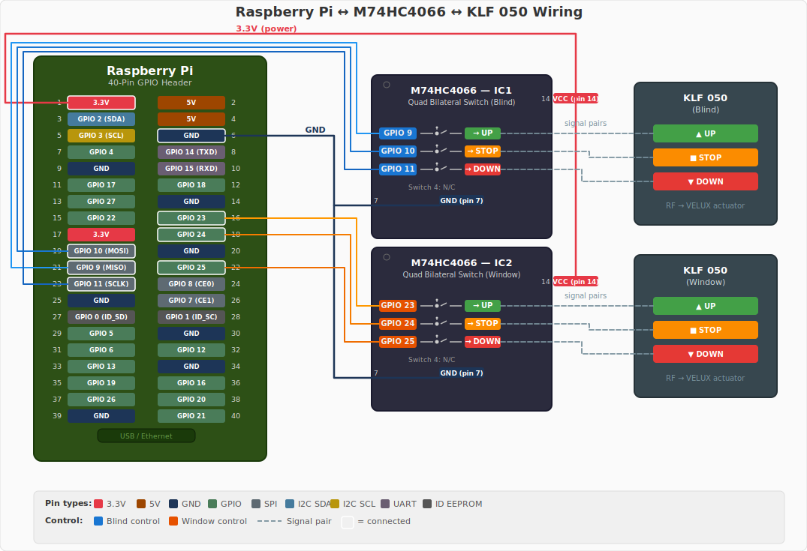

# Getting Started

This guide walks you through installing velux2mqtt, wiring the M74HC4066 switch ICs to
your KLF 050 remotes, and verifying that cover control works via MQTT.

## Prerequisites

| Requirement      | Details                                             |
| ---------------- | --------------------------------------------------- |
| **Raspberry Pi** | Any model with GPIO (Pi 3/4/5 or Zero 2 W)         |
| **M74HC4066**    | Quad bilateral switch IC (one per KLF 050 remote)   |
| **KLF 050**      | VELUX remote control with soldered button contacts   |
| **MQTT broker**  | Mosquitto, EMQX, or any MQTT 3.1.1+ broker          |
| **Python**       | 3.14+ (Docker image includes this)                  |

### Wiring

The M74HC4066 is an electronically controlled switch. When a GPIO pin goes HIGH, the
corresponding switch channel closes — bridging the button contacts on the KLF 050 and
triggering the VELUX motor.

<figure markdown>
  { width="680" }
  <figcaption>Two M74HC4066 ICs bridge the button contacts on two KLF 050 remotes. IC1 controls a blind (GPIO 9/10/11), IC2 controls a window (GPIO 23/24/25). Both ICs share 3.3V power and GND.</figcaption>
</figure>

!!! tip "Soldering the KLF 050"
    Solder thin wires to the button pads on the KLF 050 PCB — one wire for each
    button contact (UP, STOP, DOWN) plus a common wire. Use flux-core solder and a
    fine-tip iron to avoid bridging adjacent pads.

---

## Installation

=== "Docker (recommended)"

    Docker is the simplest way to run velux2mqtt. Create a directory on your Pi,
    copy this `docker-compose.yml` into it, and you're ready to go:

    ```yaml title="docker-compose.yml"
    services:
      velux2mqtt:
        image: ghcr.io/ff-fab/velux2mqtt:latest
        restart: unless-stopped
        devices:
          - /dev/gpiochip0:/dev/gpiochip0 # Pi Zero 2 W / Pi 4; use /dev/gpiochip4 for Pi 5
        group_add:
          - gpio
        env_file: .env
        environment:
          VELUX2MQTT_MQTT__HOST: mosquitto
        volumes:
          - velux2mqtt-data:/app/data
        depends_on:
          - mosquitto

      mosquitto:
        image: eclipse-mosquitto:2
        restart: unless-stopped
        ports:
          - '1883:1883'
        volumes:
          - ./mosquitto.conf:/mosquitto/config/mosquitto.conf:ro
          - mosquitto-data:/mosquitto/data
          - mosquitto-log:/mosquitto/log

    volumes:
      velux2mqtt-data:
      mosquitto-data:
      mosquitto-log:
    ```

    Then download the Mosquitto config and create your env file:

    ```bash
    curl -fsSL https://raw.githubusercontent.com/ff-fab/cosalette-apps/main/apps/velux2mqtt/mosquitto.conf -o mosquitto.conf
    curl -fsSL https://raw.githubusercontent.com/ff-fab/cosalette-apps/main/apps/velux2mqtt/.env.example -o .env
    # Edit .env with your cover and MQTT settings
    ```

    ```bash
    # Start velux2mqtt + Mosquitto
    docker compose up -d
    ```

    The container needs GPIO host access (`/dev/gpiochip0`), which the Compose file
    maps automatically.

    !!! tip "Download everything at once"
        Prefer `curl` over copy-paste? Grab all three files in one go:
        ```bash
        curl -fsSL https://raw.githubusercontent.com/ff-fab/cosalette-apps/main/apps/velux2mqtt/docker-compose.yml -o docker-compose.yml
        curl -fsSL https://raw.githubusercontent.com/ff-fab/cosalette-apps/main/apps/velux2mqtt/mosquitto.conf -o mosquitto.conf
        curl -fsSL https://raw.githubusercontent.com/ff-fab/cosalette-apps/main/apps/velux2mqtt/.env.example -o .env
        ```

    !!! note "Pin to a specific version"
        Replace `latest` with a release tag (e.g. `0.1.0`) in the `image:` line
        to pin the deployment and avoid surprises on restart.

    !!! note "Raspberry Pi 5"
        On Pi 5, change the device mapping to `/dev/gpiochip4:/dev/gpiochip4`.
        The GPIO character device number differs between Pi generations.

=== "Manual (pip/uv)"

    Install velux2mqtt directly on your Pi:

    ```bash
    pip install velux2mqtt
    # or with uv:
    uv pip install velux2mqtt
    ```

    Create a `.env` file or set environment variables, then run:

    ```bash
    velux2mqtt
    ```

    velux2mqtt reads `.env` from the current directory by default.

---

### Cover Configuration

Define your covers in the `VELUX2MQTT_COVERS` environment variable. Here's a two-cover
example for your `.env` file:

```dotenv
VELUX2MQTT_COVERS='[
  {"name": "blind", "pin_up": 9, "pin_stop": 10, "pin_down": 11, "travel_duration_up": 24.0, "travel_duration_down": 22.0},
  {"name": "window", "pin_up": 23, "pin_stop": 24, "pin_down": 25, "travel_duration_up": 30.0, "travel_duration_down": 28.0}
]'
```

---

## First Run Verification

Once velux2mqtt is running, verify data is flowing by subscribing to the MQTT topics.

### Check Status

```bash
mosquitto_sub -h localhost -t "velux2mqtt/#" -v
```

You should see messages on these topics within the first minute:

| Topic                            | What it means                                     |
| -------------------------------- | ------------------------------------------------- |
| `velux2mqtt/status`              | Heartbeat — the app is alive                      |
| `velux2mqtt/blind/availability`  | `"online"` — blind cover is ready                 |
| `velux2mqtt/blind/state`         | Position after startup homing (`{"position": 0}`) |

### Verify a Cover Command

Send a cover command to move the blind to 50%:

```bash
mosquitto_pub -h localhost -t "velux2mqtt/blind/set" -m '{"position": 50}'
```

You should see `velux2mqtt/blind/state` update with the position tracking to 50.

!!! warning "No messages?"
    - Confirm the broker is reachable:
      `mosquitto_pub -h localhost -t test -m hello`
    - Check velux2mqtt logs:
      `docker compose logs velux2mqtt` or the terminal output
    - Verify GPIO access: `ls -la /dev/gpiochip*`
    - Check user is in gpio group: `groups`

---

## Next Steps

- [Configure](configuration.md) covers, timing, homing, and drift compensation
- [MQTT Topics](mqtt-topics.md) — full topic reference with payload schemas
- [Calibration](calibration.md) — measure travel times automatically
- [Architecture](architecture.md) — understand how velux2mqtt works internally
