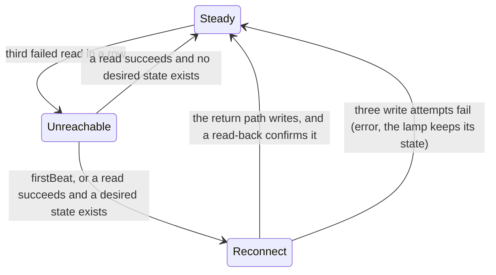

# Mains Power Awareness

Some WiZ bulbs sit behind a smart relay or a classic wall switch. When the circuit has
no mains power, every bulb on it goes dark and stops answering at the same time. When
the power comes back, each bulb boots into its factory default.

wiz2mqtt can model such a circuit as a **power source**. Then it can:

- tell an unpowered bulb from a faulty bulb,
- keep what the bulb should show while it is dark,
- give the bulb its state back when it returns,
- ask the relay for power (optional).

The decisions behind this page are
[ADR-007](adr/ADR-007-mains-power-awareness-through-power-sources.md) (power sources and
the belief), [ADR-008](adr/ADR-008-desired-state-with-restore-on-return-to-reachability.md)
(the desired state and the restore) and
[ADR-009](adr/ADR-009-power-requests-as-a-retained-desired-power-state.md) (power
requests). The key reference is in [Configuration](configuration.md#power-sources).

## Concepts

### Powered is not on

Two values describe a bulb in a power source. They answer different questions.

| Key in `wiz2mqtt/{bulb}/state` | Question                                     | Values                  |
| ------------------------------ | -------------------------------------------- | ----------------------- |
| `state`                        | What does the bulb show, or what should it show? | `"ON"`, `"OFF"`         |
| `powered`                      | Does the circuit of the bulb have mains power?   | `true`, `false`, `null` |

A bulb is **lit** when `state == "ON"` and `powered == true`. Both keys are in one
retained message, so a consumer needs no join across topics.

While wiz2mqtt cannot see the bulb, `state` is the **desired** state, not `"OFF"`. An
unpowered bulb that should be on publishes `{"state": "ON", "powered": false}`. The
reason: you can calculate reality from intent (`state` and `powered`), but you cannot
calculate intent from reality.

`powered` is `null` for a bulb outside every power source, and for a bulb whose source
belief is `unknown`.

### The belief

A power source publishes what wiz2mqtt **believes** about the circuit, not the raw relay
signal. The belief has three values: `on`, `off` and `unknown`. wiz2mqtt applies three
rules, in this order:

1. If one or more member bulbs answered after the last change of the signal, the
   belief is `on`. New evidence from a bulb outranks the signal.
2. If no member answered after the last change of the signal and the source has a
   signal, the belief is the signal.
3. If no member answers and there is no signal, `when_unreachable` decides: `unknown`
   for `fault` (the default), `off` for `no_power`.

Rule 1 makes the feature work on a circuit without a relay signal. A member counts as
"not answering" only after three failed reads in a row. One lost read does not change
the belief.

A change of the signal makes each earlier answer old. Thus a signal `off` sets the
belief `off` at once. If a member answers after the signal, the belief is `on` again. A
repeat of the same signal is not a change.

The signal also starts one read of each member. That read polls the bulb and does not
use a push that arrived before the signal. On a live circuit, a wrong signal `off` thus
shows `powered: false` normally for less than 1 s.

### Availability means a fault

`wiz2mqtt/{bulb}/availability` is `offline` only when the bulb must answer and does
not answer. That is a real fault.

- If the belief is `off`, the bulb stays `online` with `powered: false`. wiz2mqtt also
  stops reading the bulb after the third failed read, until the belief changes or the
  bulb boots. While a signal `off` decides the belief, one failed read is sufficient.
- If the belief is `on` or `unknown`, three failed reads in a row set the bulb
  `offline`.

### The desired state

Each bulb has one desired state. wiz2mqtt keeps it in its store file, so it survives a
restart. Two writers change it, and the newer write wins:

- A command on `wiz2mqtt/{bulb}/set`, at all times.
- An observation of the bulb, but only in the steady phase (see below). Thus a change
  that you make in the WiZ app becomes the new desired state.

The desired state never expires.

### Phases and the return path

A reachable bulb is in one of two phases:

- **Steady.** The bulb confirmed the last state that wiz2mqtt wrote. An observation
  counts as intent.
- **Reconnect.** The bulb came back, and wiz2mqtt did not yet confirm the intent. No
  observation counts as intent. This stops the factory default of a booted bulb from
  erasing the intent.



`firstBeat` is a broadcast that a WiZ bulb sends when it boots. It only wakes the
bulb's next read. It does not write to the bulb.

After the first successful read in the reconnect phase, exactly one of these actions
occurs:

1. If a command waits in the queue and it is not older than `queued_command_ttl`,
   wiz2mqtt applies the command. The queue is always on.
2. Else, if `restore_previous_state = true` and a stored desired state exists,
   wiz2mqtt applies the stored desired state.
3. Else, wiz2mqtt accepts the state that the bulb reports as the new desired state.

A write to restore `OFF` sends only `OFF`. A write to restore `ON` sends `ON` and the
appearance (brightness, colour or scene) in one command. wiz2mqtt reads the state back
after each write. It tries a maximum of three times in total. If all three attempts
fail, it publishes an error on `wiz2mqtt/{bulb}/error`, goes to the steady phase and
keeps the state of the lamp.

## Operator guide

### Declare a power source

Declare the circuit and its members with `group` or with `members`, not both:

```toml
[[groups]]
name = "downstairs"
members = ["living-room", "kitchen", "hall"]

[[power_sources]]
name = "downstairs-circuit"
group = "downstairs"            # every bulb of the group

[[power_sources]]
name = "porch-circuit"
members = ["porch"]             # or name the bulbs directly
```

If one bulb of a group sits on a different circuit, set `power_source` on that bulb:

```toml
[[bulbs]]
name = "hall"
ip = "192.168.1.104"
power_source = "porch-circuit"  # wins over the group claim above
```

wiz2mqtt resolves the source of each bulb in this order:

1. The `power_source` key on the bulb.
2. A source whose `members` names the bulb.
3. A source whose `group` contains the bulb.
4. No source: the bulb has no power awareness and `powered` is always `null`.

A bulb belongs to a maximum of one source. If two sources claim the same bulb through
`members` or `group`, wiz2mqtt does not start.

### Connect a relay signal

`signal_topic` is optional. Without it, the belief comes from the bulbs alone. With it,
wiz2mqtt knows why a whole circuit is dark.

- wiz2mqtt accepts only the payloads `on` and `off`, in lowercase, after one trim of
  whitespace. It ignores any other payload and logs a warning.
- Publish the signal **retained**. After a restart, wiz2mqtt reads the last signal from
  the broker. A non-retained signal stays unknown until the relay changes again.
- The topic must not be below the topic prefix of wiz2mqtt, and each source needs its
  own topic.
- Give write access to the relay publisher only. wiz2mqtt needs read access only
  (`cosalette schema acl` generates this rule).

An openHAB rule that publishes a relay item as the signal:

```java
rule "Downstairs relay to wiz2mqtt signal"
when
    Item Downstairs_Relay changed
then
    val mqtt = getActions("mqtt", "mqtt:broker:broker")
    mqtt.publishMQTT("openhab/relay/downstairs/state",
        Downstairs_Relay.state.toString.toLowerCase, true)
end
```

### Choose `when_unreachable`

`when_unreachable` on a power source tells wiz2mqtt what an unreachable bulb means when
it has no better evidence (no answering member and no signal).

| Value             | Belief    | Availability of the unreachable bulb | Use it when                                                  |
| ----------------- | --------- | ------------------------------------ | ------------------------------------------------------------ |
| `fault` (default) | `unknown` | `offline` after three failed reads   | The circuit is normally on, and a dark bulb means a problem. |
| `no_power`        | `off`     | stays `online`                       | A wall switch cuts the circuit often, and that is normal.    |

### Restore and queue

- `restore_previous_state = true` on a bulb makes wiz2mqtt write the stored desired
  state back after the bulb boots. The default is `false`: the bulb keeps its factory
  default, and that becomes the new desired state.
- The queue is always on. A command that arrives while the bulb is unreachable is
  applied when the bulb returns, also with `restore_previous_state = false`.
- `queued_command_ttl` (top level, in seconds, default `86400`) is the maximum age of
  a queued command. wiz2mqtt drops an older command and writes a log line.

### Power requests

A power source can ask for a change of its circuit. wiz2mqtt publishes the request
retained in `wiz2mqtt/{source}/state` as `power_request`. It never operates the relay
itself. Your consumer maps the request to the relay.

- `enable_power_on_request = true`: an accepted command that makes a member bulb
  desired `ON` while the belief is `off` gives `power_request: "on"`.
- `enable_power_off_request = true`: when every member has been desired `OFF` for
  `power_off_idle_delay` seconds (default `600`), wiz2mqtt publishes
  `power_request: "off"`. This direction needs `wiz_bulbs_only = true`.
- `power_request: null` means "no request". wiz2mqtt clears a request when the belief
  agrees with it, or when the request does not apply any more.

!!! warning "Do not set `enable_power_off_request` on a circuit with other loads"
    While the key is set, wiz2mqtt owns the relay. A user who switches the relay by
    hand fights the idle timer. `wiz_bulbs_only = true` is your statement that no fan,
    socket or other lamp is on the circuit.

The retained request stays on the broker when wiz2mqtt stops. That is intended: a
consumer that connects later still reads the current request. At startup, wiz2mqtt
publishes `null` first and then calculates the request again from the belief. Thus a
restart alone never cuts a circuit.

### Migrate a bulb-level `when_unreachable`

Earlier releases had `when_unreachable` on the bulb. wiz2mqtt still starts with it,
and logs one warning per bulb. For a bulb `lamp` with `when_unreachable = "off"`, the
warning is:

```text
Bulb lamp: when_unreachable = 'off' is replaced by power_source = 'lamp-power' (see [[power_sources]] name = 'lamp-power', when_unreachable = 'no_power'); update wiz2mqtt.toml
```

Replace the bulb key with the block that the warning names:

```toml
[[bulbs]]
name = "lamp"
ip = "10.0.0.11"
power_source = "lamp-power"

[[power_sources]]
name = "lamp-power"
members = ["lamp"]
when_unreachable = "no_power"
```

For `when_unreachable = "unavailable"`, remove the key. That behaviour is now the
default for a bulb outside every power source. The next release removes this migration,
and a bulb-level `when_unreachable` then stops wiz2mqtt at startup.

### Keep the store on a volume

The desired state is in the store file; queued commands are in memory only and
are lost on restart. Set `WIZ2MQTT_STORE_PATH` to a path inside a mounted volume.
If the file is in the container layer, a container restart loses every desired
state, and `restore_previous_state` has nothing to restore. The shipped `compose.yml` sets
`WIZ2MQTT_STORE_PATH=/app/data/store.json` on the `wiz2mqtt-data` volume.

## Consumer recipes

### openHAB

Generate the Things and Items as described in
[openHAB generation](configuration.md#openhab-generation). For each power source you
get two read-only Items. For each bulb in a source, you get one more read-only Item:

| Item                               | Meaning                                         |
| ---------------------------------- | ----------------------------------------------- |
| `Wiz2Mqtt_<Source>_Powered`        | The belief: `ON`, `OFF`, or `NULL` for unknown  |
| `Wiz2Mqtt_<Source>_PowerRequest`   | The request: `ON`, `OFF`, or `NULL` for none    |
| `Wiz2Mqtt_<Bulb>_Powered`          | The belief of the bulb's source                 |

!!! note "`NULL` needs openHAB 5.1 or later"
    The generated channels use the `nullValue` parameter for `unknown` and JSON `null`.
    A switch channel supports it from openHAB 5.1. openHAB 5.0 logs a warning and keeps
    the last value. openHAB sets `NULL`, not `UNDEF`: the MQTT binding cannot set
    `UNDEF` from a message. To test for "no value", use `instanceof UnDefType`.

**Lit.** Calculate "lit" from the two Items of one bulb:

```java
rule "Living room lit"
when
    Item Wiz2Mqtt_LivingRoom_State changed or
    Item Wiz2Mqtt_LivingRoom_Powered changed
then
    LivingRoom_Lit.postUpdate(
        if (Wiz2Mqtt_LivingRoom_State.state == ON &&
            Wiz2Mqtt_LivingRoom_Powered.state == ON) ON else OFF)
end
```

**The relay.** Your relay Item stays the main light switch that users operate.
wiz2mqtt does not generate a relay Item or a rule. To let wiz2mqtt ask for power, map
the request to the relay:

```java
rule "Downstairs circuit follows the wiz2mqtt power request"
when
    Item Wiz2Mqtt_DownstairsCircuit_PowerRequest changed
then
    val request = Wiz2Mqtt_DownstairsCircuit_PowerRequest.state
    if (request == ON || request == OFF) {
        Downstairs_Relay.sendCommand(request as OnOffType)
    }
end
```

The rule triggers on `changed`, not on `received update`. Thus a repeat of the retained
message (MQTT 5 refresh) does not send the command again. `NULL` means "no request", so
the rule does nothing.

**Thing availability.** Each generated bulb Thing reads the availability topic of its
bulb. The Thing goes `OFFLINE` when the bulb publishes `offline`, and openHAB then does
not apply a command to the Item by autoupdate. Because an unpowered bulb stays
`online`, a command to it is still queued and applied when the power returns. Only a
real fault makes the Thing `OFFLINE`. This is a change for existing openHAB users: it
takes effect when you generate your Things again.

### Home Assistant

wiz2mqtt announces its entities through MQTT discovery. You configure nothing.

- **The light** is a JSON-schema light with a state topic. Home Assistant shows the
  state that wiz2mqtt publishes, which is the desired state while the bulb is dark. Do
  not set `optimistic: true` in an override. It makes the entity `assumed_state`, and
  Home Assistant then shows two buttons instead of a toggle.
- **Each power source** is one device with two binary sensors:

  | Entity          | Class                           | `on`                        | `off`                      | Unknown           |
  | --------------- | ------------------------------- | --------------------------- | -------------------------- | ----------------- |
  | `powered`       | `device_class: power`           | The belief is `on`          | The belief is `off`        | Belief `unknown`  |
  | `power_request` | `entity_category: diagnostic`   | wiz2mqtt asks for power     | Off request, or no request | never             |

  Both are read-only. wiz2mqtt never announces a switch for a circuit.

**Lit.** This MQTT binary sensor calculates "lit" from the one bulb message. Replace
`living-room` with the name of your bulb:

```yaml
mqtt:
  binary_sensor:
    - name: "Living room lit"
      unique_id: wiz2mqtt_living_room_lit
      device_class: light
      state_topic: "wiz2mqtt/living-room/state"
      availability_topic: "wiz2mqtt/living-room/availability"
      value_template: >-
        OFF
        ON
        None
```

The template gives `OFF` if the bulb should be off or has no power, `ON` if it should
be on and has power, and unknown if the belief is unknown.

## Timing

| Event                                                   | Expected time                                                                  |
| ------------------------------------------------------- | ------------------------------------------------------------------------------ |
| Power returns, `firstBeat` reaches the host             | The restore starts less than 1 s after the bulb boots.                         |
| Power returns, no `firstBeat` (for example, no host networking) | The restore starts on the next heartbeat read, a maximum of 60 s later. |
| Circuit goes dark, no signal                            | 159 s to 219 s until the belief changes; 192 s to 252 s on a host that receives idle pushes from the bulbs. |
| Circuit goes dark, signal `off` arrives                 | At once: the belief becomes `off`. wiz2mqtt stops reading a member after its first failed read, about 13 s after the signal. |
| Signal `on` arrives while no member answers             | At once: the belief becomes `on`.                                              |

A failed read takes 13 s (the pywizlight timeout), and the heartbeat waits 60 s after
each read. Without a signal, three failed reads in a row are necessary before a bulb
counts as not answering.
